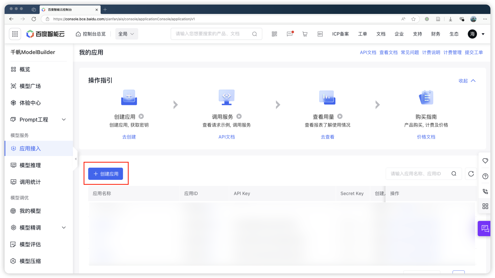
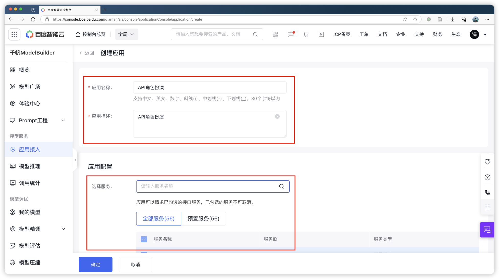
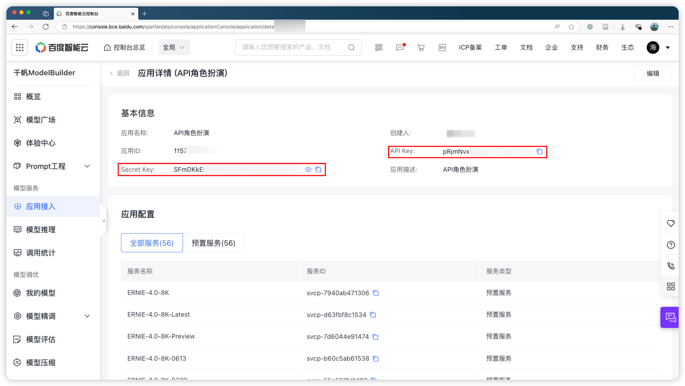
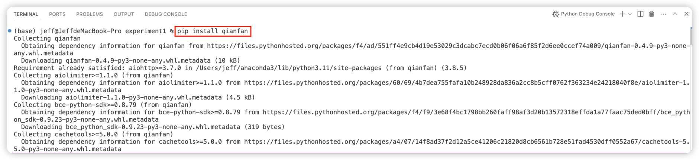
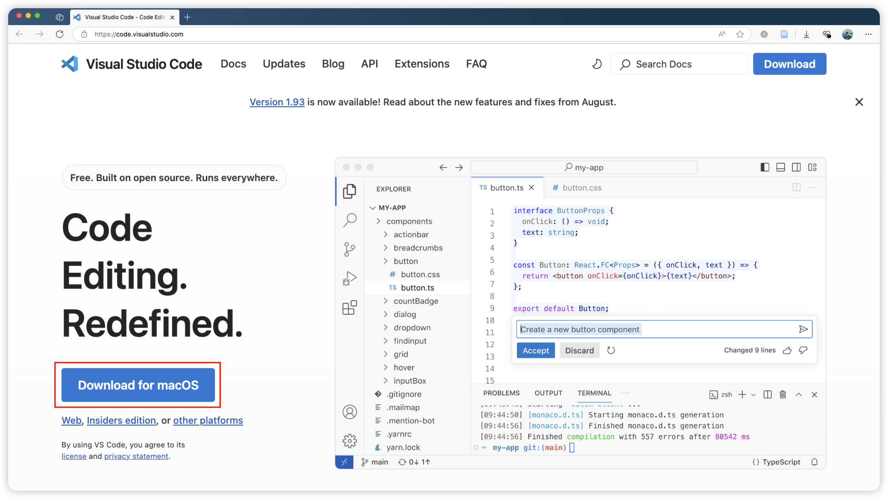
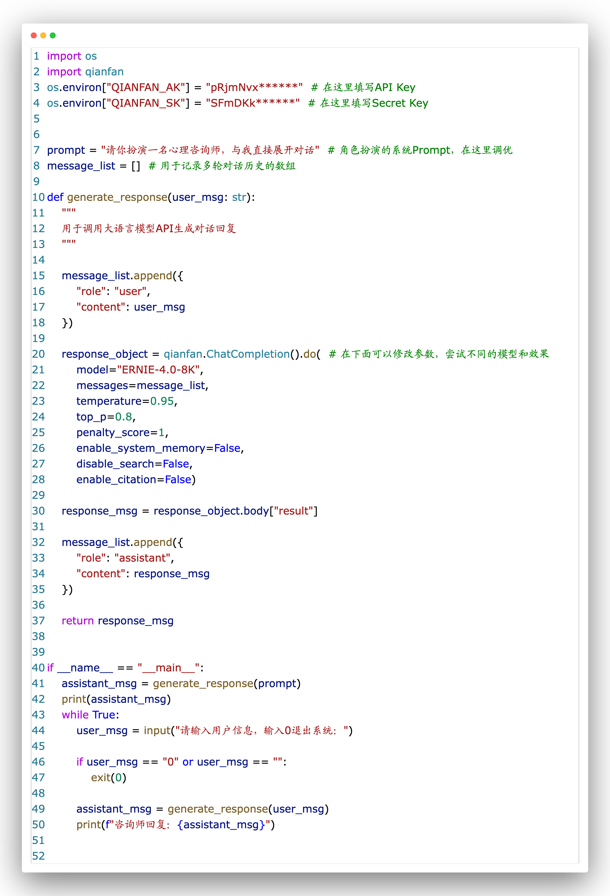
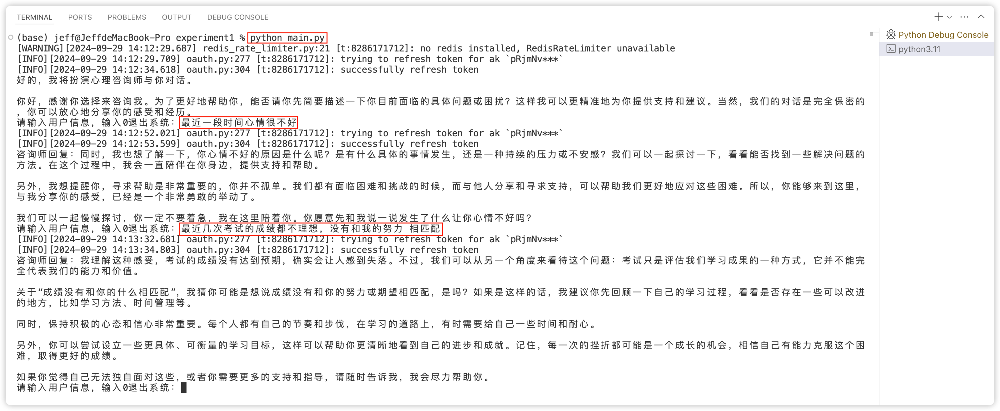

# 课程练习1：基于Prompt技术API调用的角色扮演

# 1 环境准备

大型语言模型ERNIE-4（百度文心）、Python + qianfan SDK、VS Code

## 1.1 ERNIE-4

### 1.1.1 创建应用

进入[https://console.bce.baidu.com/qianfan/ais/console/applicationConsole/application/v1](https://console.bce.baidu.com/qianfan/ais/console/applicationConsole/application/v1 "https://console.bce.baidu.com/qianfan/ais/console/applicationConsole/application/v1")，创建应用



填写创建应用的相关信息，并使用默认的应用配置（即全部服务）



记录API Key和Secret Key信息



## 1.2 Python + qianfan SDK

安装好Python（建议使用Anaconda）后，安装qianfan SDK

```bash
pip install qianfan
```



## 1.3 VS Code

访问[https://code.visualstudio.com/](https://code.visualstudio.com/ "https://code.visualstudio.com/")，下载IDE并安装用于代码编写



# 2 代码编写

## 2.1 代码全文



## 2.2 运行效果



# 3 练习要求

> 📌通过不断调整prompt中的内容，或调用模型时的参数，或使用多种Prompt 技术（如上下文学习、Chain-of-Thought、Self-Consistency），使大语言模型的回复更加具有人类心理咨询师的共情能力和专业性。

扩展阅读列表：

- 大语言模型调用时的参数设定：[https://www.promptingguide.ai/introduction/settings](https://www.promptingguide.ai/introduction/settings "https://www.promptingguide.ai/introduction/settings")
- Prompt工程技术：[https://medium.com/the-modern-scientist/best-prompt-techniques-for-best-llm-responses-24d2ff4f6bca](https://medium.com/the-modern-scientist/best-prompt-techniques-for-best-llm-responses-24d2ff4f6bca "https://medium.com/the-modern-scientist/best-prompt-techniques-for-best-llm-responses-24d2ff4f6bca")
